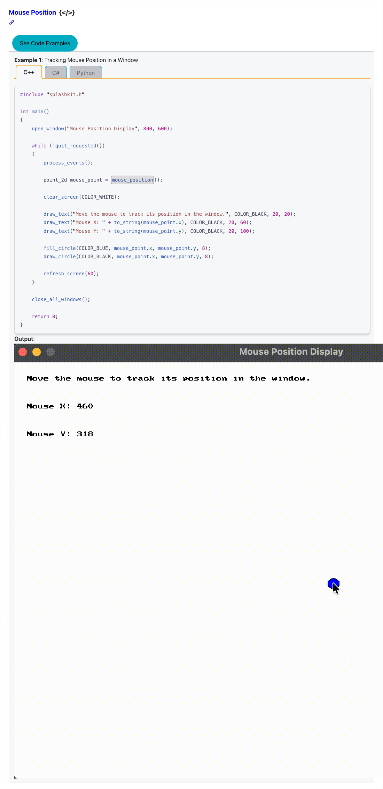
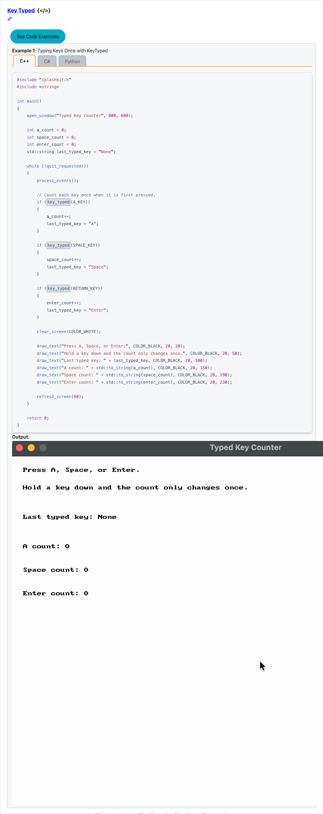
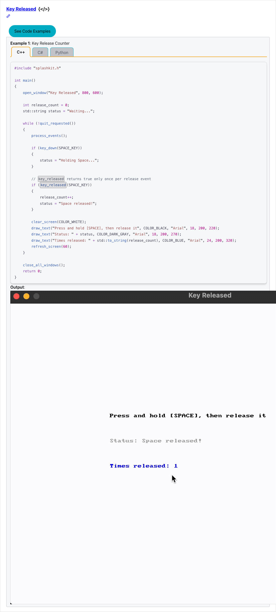
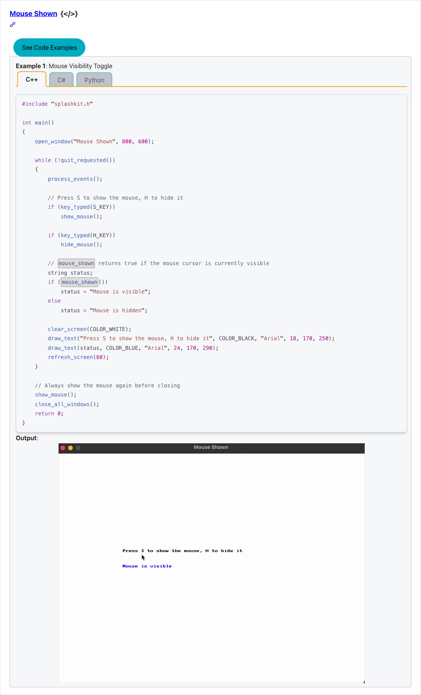
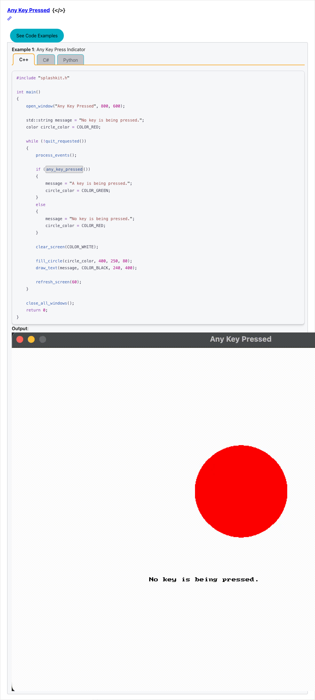
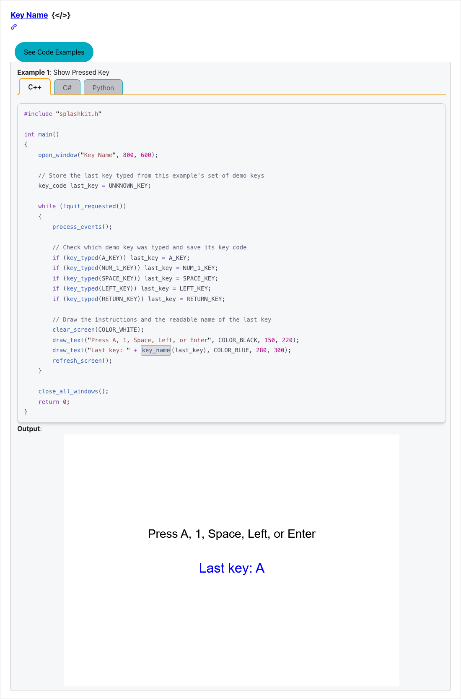

# Team Progress Demo — 2026-05-12

## What we shipped this trimester (since 1 March 2026)

Across the team, **24 pull requests have reached 2+ peer approvals** and are queued for the final upstream merge — covering input handling, graphics primitives, interface widgets, geometry, color, timers, and a generative-AI tutorial guide. Today's demo bundles **9 of those PRs** into a private staging branch (`demo/leadership-2026-05-12`) so the resulting site can be browsed live, end-to-end. A further 7 PRs sit at first-review; new contributions are still landing weekly.

## How to read this demo

- All 9 features below are bundled on local branch **`demo/leadership-2026-05-12`** (none of these PRs are merged to upstream `main` yet — they're in the 2nd-review queue).
- Local preview: <http://localhost:4321>
- **Heads up on search:** the search box in the top bar will not return results in this local build. The DocSearch (Algolia) index is only populated against the production site at <https://splashkit.io>. If anyone asks to demo search, switch the browser tab to live and run the same query.
- Each feature below has a screenshot of how the function appears on the documentation page after the build pipeline auto-injects the C++ / C# (top-level) / C# (OOP) / Python tabs and the GIF / PNG output asset.

---

## Feature walkthrough

### 1. `draw_circle` — graphics

URL: <http://localhost:4321/api/graphics/#draw-circle>

Adds two new variants for `draw_circle`: an animation example (a perpetually growing/shrinking circle) and an interactive example (radius controlled by mouse). Demonstrates the function on a real visual, not just signature documentation.

**Author:** @jankiluitel · PR [#712](https://github.com/thoth-tech/splashkit.io-starlight/pull/712)

---

### 2. `key_down` — input

URL: <http://localhost:4321/api/input/#key-down>

Detects whether a keyboard key is currently held down (vs `key_typed`, which fires once per press). Animated GIF shows the cursor changing colour as different keys are held.

**Author:** @jasveena15 · PR [#702](https://github.com/thoth-tech/splashkit.io-starlight/pull/702)

---

### 3. `mouse_position` — input

URL: <http://localhost:4321/api/input/#mouse-position>

Returns the cursor's current `(x, y)` as a `Point2D`. The example animates a small circle following the cursor in real time, with live coordinates rendered above.

**Author:** @Osaid2993 · PR [#710](https://github.com/thoth-tech/splashkit.io-starlight/pull/710)

---

### 4. `key_typed` — input

URL: <http://localhost:4321/api/input/#key-typed>

The "single press" sibling of `key_down`. Fires exactly once per key press, ideal for menu navigation or toggle behaviour. The GIF demonstrates one event per tap.

**Author:** @Osaid2993 · PR [#732](https://github.com/thoth-tech/splashkit.io-starlight/pull/732)

---

### 5. `key_released` — input

URL: <http://localhost:4321/api/input/#key-released>

Fires when a previously-held key is let go — useful for charge-up mechanics, hold-to-aim controls, etc. Closes out the keyboard event-state trio with `key_down` and `key_typed`.

**Author:** @abdullah12121212 · PR [#733](https://github.com/thoth-tech/splashkit.io-starlight/pull/733)

---

### 6. `mouse_shown` — input

URL: <http://localhost:4321/api/input/#mouse-shown>

Bonus example bundled in the same PR as `key_released`. Returns whether the OS cursor is currently visible in the SplashKit window — pairs with `hide_mouse` / `show_mouse` for cursor-locked games.

**Author:** @abdullah12121212 · PR [#733](https://github.com/thoth-tech/splashkit.io-starlight/pull/733)

---

### 7. `any_key_pressed` — input

URL: <http://localhost:4321/api/input/#any-key-pressed>

Convenience function for "press any key to continue" splash screens — fires `true` when any keyboard key is currently down without needing to enumerate `KeyCode` values.

**Author:** @Osaid2993 · PR [#734](https://github.com/thoth-tech/splashkit.io-starlight/pull/734)

---

### 8. `key_name` — input

URL: <http://localhost:4321/api/input/#key-name>

Returns the human-readable name for a `KeyCode` (e.g. `"Space"`, `"Left Arrow"`). Useful for in-game key-binding UIs that show players what's mapped where.

**Author:** @KayDee6751 · PR [#745](https://github.com/thoth-tech/splashkit.io-starlight/pull/745)

---

### 9. `button` — interface

URL: <http://localhost:4321/api/interface/#button>

A first-class interface widget — renders a clickable button with hover/active states and returns `true` on click. Shifts SplashKit's UI offering from "draw your own" to "compose with provided primitives."

**Author:** @ralphweng-autograb · PR [#709](https://github.com/thoth-tech/splashkit.io-starlight/pull/709)

---

### 10. AI Prompt Helper for SplashKit Game Ideas — generative-AI guide

URL: <http://localhost:4321/guides/generative-ai/ai-prompt-helper-for-splashkit/>

A different artifact type — a tutorial guide page (not a usage example). Walks SplashKit learners through using AI tools responsibly: prompting patterns for game-idea generation, function lookup, debugging, and pseudocode planning, plus a "good prompt vs bad prompt" comparison and a responsible-use checklist.

**Author:** @jankiluitel · PR [#749](https://github.com/thoth-tech/splashkit.io-starlight/pull/749)

---

## Anticipated questions

**"Why aren't these merged to upstream `main` yet?"**
They've passed peer review (2+ approvals each) and are in the maintainer queue at `thoth-tech/splashkit.io-starlight`. This demo branch bundles them so the team's progress can be evaluated as a coherent slice rather than waiting for the upstream merge cadence.

**"How are usage examples authored?"**
Each example is six files under `public/usage-examples/<category>/`: `.cpp`, `.cs` (top-level), `.cs` (OOP), `.py`, a one-line `.txt` title, and a `.gif` / `.png` / `.webm` output asset. The build pipeline (`scripts/api-pages-script.cjs`) scans these at `npm run build` time and auto-injects them into the corresponding API reference MDX page as a tabbed code block plus the visual.

**"What's the test coverage story?"**
Code samples are compile-checked at build time via `usage-examples-testing-script.cjs` to catch broken samples before they reach the published docs. The build also gates on Astro's content-collection schema validation.

**"Why is local search disabled?"**
The site uses Algolia DocSearch, which crawls the production deployment to build its index. Local builds intentionally don't ship that index — only the live `splashkit.io` site has searchable content. If you want to demo search, jump to live.

**"How many PRs are in flight overall?"**
24 PRs have 2+ approvals and are ready to merge upstream. 7 more sit at first-review. 12 are in the second-review queue. Today's demo shows 9 of the 24 ready-to-merge tier.

---

## What's next

- More usage-example coverage across remaining API surface (geometry overloads, networking, audio).
- Continue the second-review queue clear-out so the upstream `main` branch reflects current team output.
- Expand the generative-AI guide stream — author handles a tutorial pattern other contributors can follow.

---

*This document corresponds to local branch `demo/leadership-2026-05-12` built at 2026-05-12. Backup at <https://github.com/ralphweng2023/splashkit.io-starlight/tree/demo/leadership-2026-05-12> after push.*
