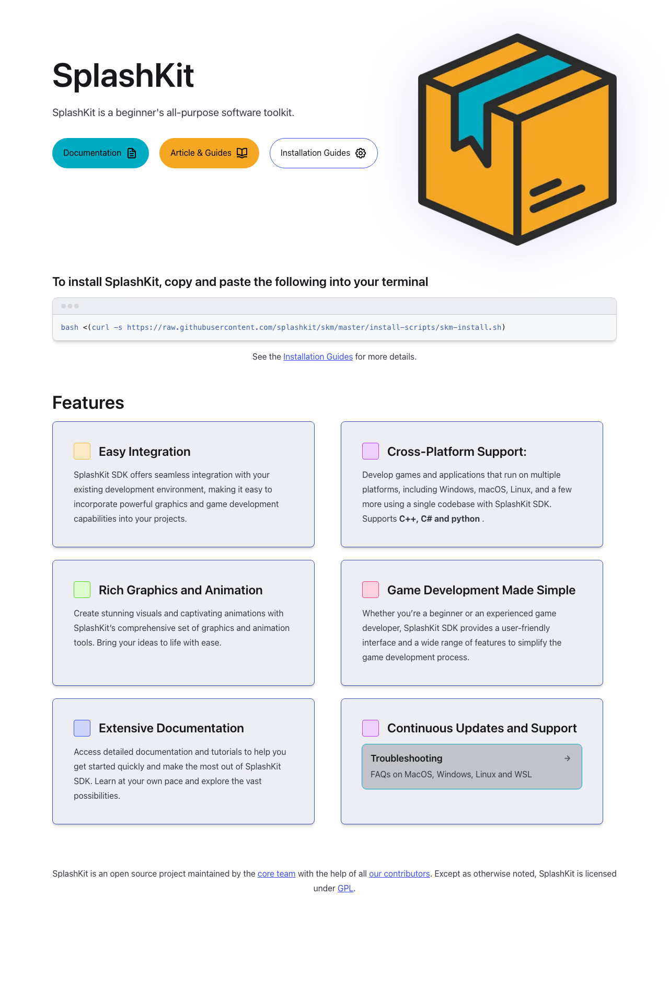
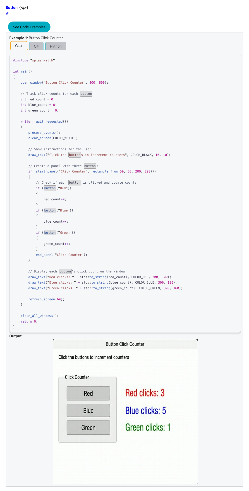
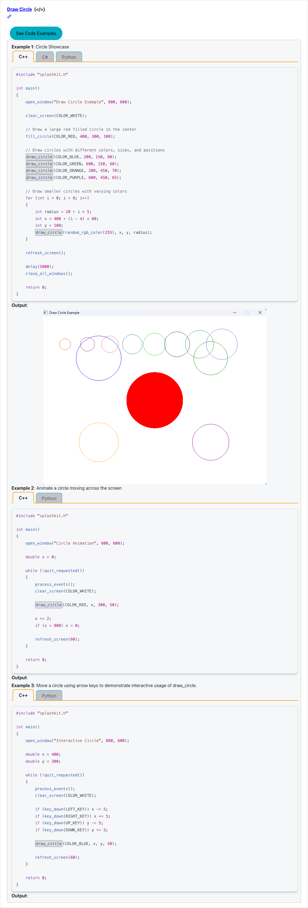
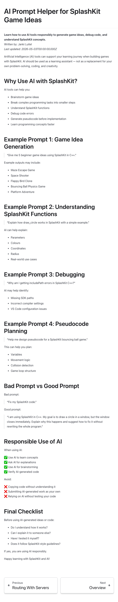
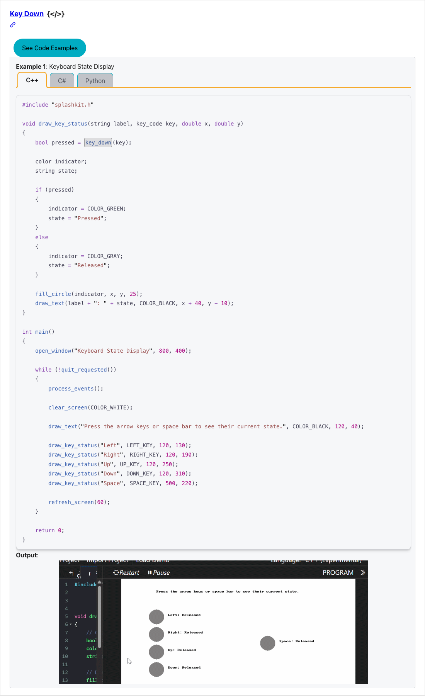

splashkit.io · the SplashKit website

<h1 class="cover-title">SplashKit Website</h1>

Team Progress Demo

12 May 2026 
Presenter: Ralph Weng 
Branch: <code>demo/leadership-2026-05-12</code>

# Team Progress Demo — 2026-05-12

## What we shipped this trimester

This demo is for the **[SplashKit website](https://splashkit.io)** — the public documentation, tutorials, and API reference site that SplashKit learners and developers use as their primary entry point. The repo behind the site is `thoth-tech/splashkit.io-starlight` (Astro + Starlight).

  

11

student contributors

  

22

peer-approved PRs

  

9

shipping in today's demo

**Eleven student contributors shipped 22 peer-approved PRs** to the website since 1 March 2026 — closing out the keyboard and mouse input documentation, adding the **first interface widget** (`button`) to the API reference, and introducing a new artefact type: a **generative-AI tutorial guide** for SplashKit learners.

Today walks through **9 of those PRs**, live, on a local build that bundles them into a single staging branch (`demo/leadership-2026-05-12`).

Every contributor wrote, tested, and documented their function in **four languages** — C++, C# (top-level), C# (OOP), and Python — the unit's core competency.

## Team & velocity

| Metric | This trimester |
|---|---|
| Open PRs since 1 March | **63** |
| Ready to merge (2+ approvals, no change requests) | **22** |
| In second review (1 approval) | **12** |
| Awaiting first review | **6** |
| Unique student contributors to the ready-to-merge tier | **11** |

The 9 PRs in today's demo were selected for **visual variety + breadth across three API areas** (graphics, input, interface) plus one non-code artefact (the AI guide). The remaining 13 ready-to-merge PRs follow the same authoring pattern.

## Feature walkthrough

### CONTEXT The site itself Feature 0

**Local:** <http://localhost:4321/> &nbsp;·&nbsp; **Live:** <https://splashkit.io/>

The SplashKit website is the entry point for every learner and contributor. Built on Astro + Starlight, generated from `thoth-tech/splashkit.io-starlight`. The 9 features below all surface inside this site — under **API Documentation** (the `button`, `draw_circle`, and input examples) and **Tutorials and Guides** (the AI Prompt Helper). Today we'll click through each one on the local build of this site.

### INTERFACE 1. `button` — first interface widget Feature 1

**Local:** <http://localhost:4321/api/interface/#button> &nbsp;·&nbsp; **Live:** <https://splashkit.io/api/interface/#button>

A first-class interface widget: renders a clickable button with hover and active states, returns `true` on click. Shifts SplashKit's UI offering from "draw your own controls" to "compose with provided primitives." Unblocks every future widget — sliders, checkboxes, dropdowns — that would otherwise need to ship `button` first.

**Author:** Ralph Weng (@ralphweng-autograb) · PR [#709](https://github.com/thoth-tech/splashkit.io-starlight/pull/709)

### GRAPHICS 2. `draw_circle` — graphics Feature 2

**Local:** <http://localhost:4321/api/graphics/#draw-circle> &nbsp;·&nbsp; **Live:** <https://splashkit.io/api/graphics/#draw-circle>

Two new variants for `draw_circle`: an animation example (a perpetually growing/shrinking circle) and an interactive example (radius controlled by the mouse). Demonstrates the function on a real visual, not just signature documentation — exactly the kind of "see it, then read about it" a learner needs.

**Author:** Janki Luitel (@jankiluitel) · PR [#712](https://github.com/thoth-tech/splashkit.io-starlight/pull/712)

### GUIDE 3. AI Prompt Helper — generative-AI guide Feature 3

**Local:** <http://localhost:4321/guides/generative-ai/ai-prompt-helper-for-splashkit/> &nbsp;·&nbsp; *Live: not yet — this is a brand-new guide page*

A different artefact type — not a usage example, a **tutorial guide page**. Walks SplashKit learners through using AI tools responsibly: prompting patterns for game-idea generation, function lookup, debugging, and pseudocode planning, plus a "good prompt vs bad prompt" comparison and a responsible-use checklist. Establishes a pattern other contributors can replicate.

**Author:** Janki Luitel (@jankiluitel) · PR [#749](https://github.com/thoth-tech/splashkit.io-starlight/pull/749)

### INPUT 4. Input handling — completing the input surface Feature 4

Six new examples across five PRs, finishing off SplashKit's keyboard and mouse event coverage. Each example follows the same four-language pattern with a recorded GIF demonstrating the behaviour.

| Function | What it adds | Author | PR |
|---|---|---|---|
| `key_down` | Detect a held-down keyboard key (vs `key_typed`, which fires once per press) | Jasveena (@jasveena15) | [#702](https://github.com/thoth-tech/splashkit.io-starlight/pull/702) |
| `mouse_position` | Returns the cursor's `(x, y)` as a `Point2D`; example animates a tracker dot | Osaid (@Osaid2993) | [#710](https://github.com/thoth-tech/splashkit.io-starlight/pull/710) |
| `key_typed` | Single-press event — powers menu navigation, pause toggles, one-shot weapon fire | Osaid (@Osaid2993) | [#732](https://github.com/thoth-tech/splashkit.io-starlight/pull/732) |
| `key_released` | Fires when a held key is let go — useful for charge-up / hold-to-aim mechanics | Abdullah (@abdullah12121212) | [#733](https://github.com/thoth-tech/splashkit.io-starlight/pull/733) |
| `mouse_shown` | Whether the OS cursor is visible — pairs with `hide_mouse` / `show_mouse` for cursor-locked games (bundled in #733) | Abdullah (@abdullah12121212) | [#733](https://github.com/thoth-tech/splashkit.io-starlight/pull/733) |
| `any_key_pressed` | "Press any key to continue" — without it, contributors had to loop every `KeyCode`. One line vs ~200. | Osaid (@Osaid2993) | [#734](https://github.com/thoth-tech/splashkit.io-starlight/pull/734) |
| `key_name` | Returns the human-readable name for a `KeyCode` (`"Space"`, `"Left Arrow"`) — for in-game key-binding UIs | Kris Denman (@KayDee6751) | [#745](https://github.com/thoth-tech/splashkit.io-starlight/pull/745) |

**Hero example for the demo:** `key_down`. The recorded GIF on the page shows a live keyboard-state display (Left / Right / Up / Down / Space) updating in real time as keys are held.

**Local:** <http://localhost:4321/api/input/#key-down> &nbsp;·&nbsp; **Live:** <https://splashkit.io/api/input/#key-down>

## Anticipated questions

> **Why aren't these merged to upstream `main` yet?**
>
> They've passed peer review (2+ approvals each) and are queued at the `thoth-tech/splashkit.io-starlight` upstream. Peer review and authoring move faster than maintainer merge cadence — that's the bottleneck the program is currently working through.

> **What's the maintainer review SLA?**
>
> There isn't a formal one. Upstream maintainers merge in batches when they're available. The team's job is to keep the queue full and reviewable; the merge gate is downstream of us.

> **How do you pick what gets demoed?**
>
> Visual variety + breadth across API areas. The 9 chosen here cover graphics, input, interface, and the new generative-AI guide stream. The other 13 ready-to-merge PRs are more keyboard / geometry / utilities and follow the same authoring pattern.

> **How are usage examples authored?**
>
> Each example is six files under `public/usage-examples/<category>/`: `.cpp`, `.cs` (top-level), `.cs` (OOP), `.py`, a one-line `.txt` title, and a `.gif` / `.png` / `.webm` output asset. The build pipeline (`scripts/api-pages-script.cjs`) scans these at `npm run build` time and auto-injects them into the API reference page as a tabbed code block plus the visual.

> **Test coverage?**
>
> Code samples are compile-checked at build time via `usage-examples-testing-script.cjs`. Visual output (the GIFs) is verified by human reviewers — that's a known gap, currently caught at the peer-review stage.

> **How many PRs in flight overall?**
>
> 63 open since trimester start. 22 ready to merge, 12 awaiting a second approval, 6 awaiting first review. The remainder are blocked on author follow-up after a change request.

## What's next

- **Clear the remaining 13 ready-to-merge PRs** to upstream by end of trimester so the public docs reflect current team output.
- **Onboard 2 new contributors to the AI-guide pattern** Janki established — extends our coverage beyond pure code samples.
- **Begin geometry and audio coverage** — currently 0 student-authored usage examples in those categories despite both being core SplashKit surface area.

---

<em>Note on local search: the search box at the top of the local preview will not return results — the Algolia index is only built against the production site at <a href="https://splashkit.io">splashkit.io</a>. Switch to live if a search demo is requested.</em>

<em>This document corresponds to local branch <code>demo/leadership-2026-05-12</code> built at 2026-05-12. Backup at <a href="https://github.com/ralphweng2023/splashkit.io-starlight/tree/demo/leadership-2026-05-12">github.com/ralphweng2023/splashkit.io-starlight</a>.</em>

